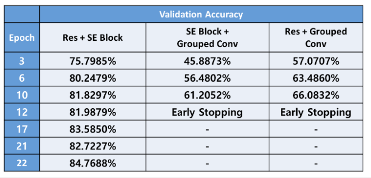

# CCamp-Image-Classification-Project
- 2022크리에이터 캠프 이미지 분류 프로젝트 정리

느낀 점 & 보완할 점
개인적으로 참가하는 첫 AI 대회였다. 딥러닝은 내 생각보다 더 어렵고 상당한 인내가 필요하다 ...
- GPU의 한계,이미지의 크기,배치사이즈로 인해서 사용할 수 있는 모델은 극히 제한된다 -> CV는 좋은 장비가 필요하다.
- 오버피팅을 막기 위해서 증강을 상당히 많은 양을 시도함 
    - 그냥 많이 하면 좋겠지라는 막연한 생각을 했다.
    - 학습시간을 너무 오래 걸리게 했다.
- 조금 더 체계적으로 실험을 진행해야 한다.
    - 다양한 방법들을 찾는 소스를 알아야 한다.(ex,중복이미지 어떻게 제거?) 아마 survey논문을 찾아보면 좋지 않을까?
    - 그냥 알려진 증강들을 막 넣는것이 아니라 하나하나 실험해보면서 넣었어야 했다.
    - 모델의 구조도 여러가지로 시도해봤어야 했다.
    - optimizer의 인자도 여러 조합을 시도해봤어야 했다.(Grid Search 느낌)
- 팀 전체가 반드시 중간중간 과정들을 반드시 정리해서 서로에게 알려줄 수 있어야 한다.(이 과정이 없으면 사실상 혼자하는 대회이다.)